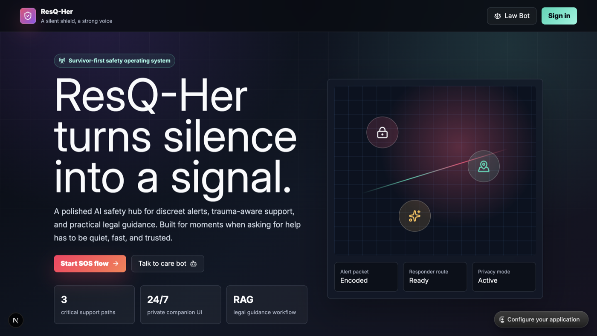
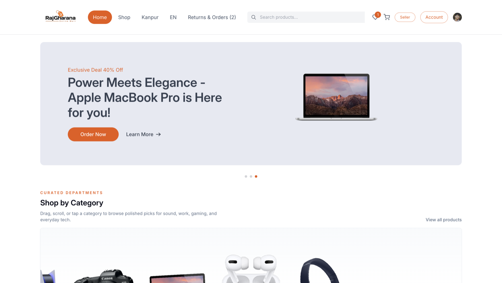
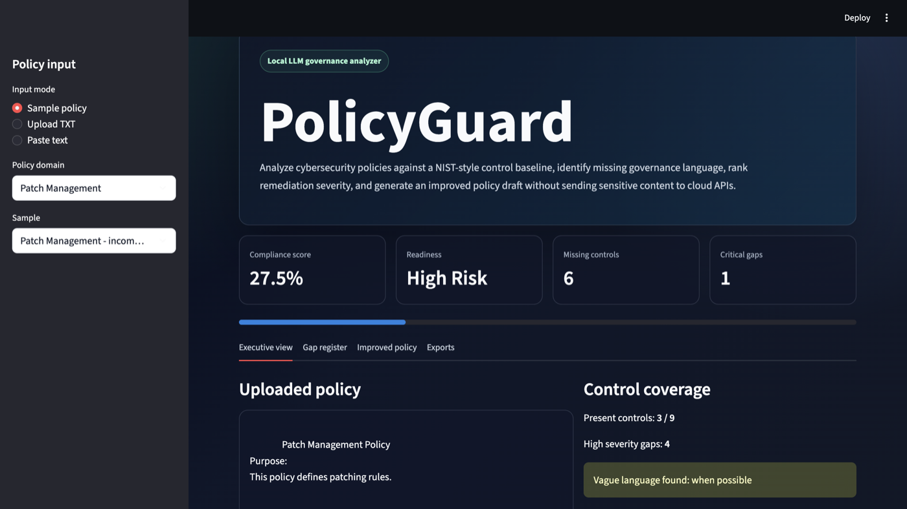
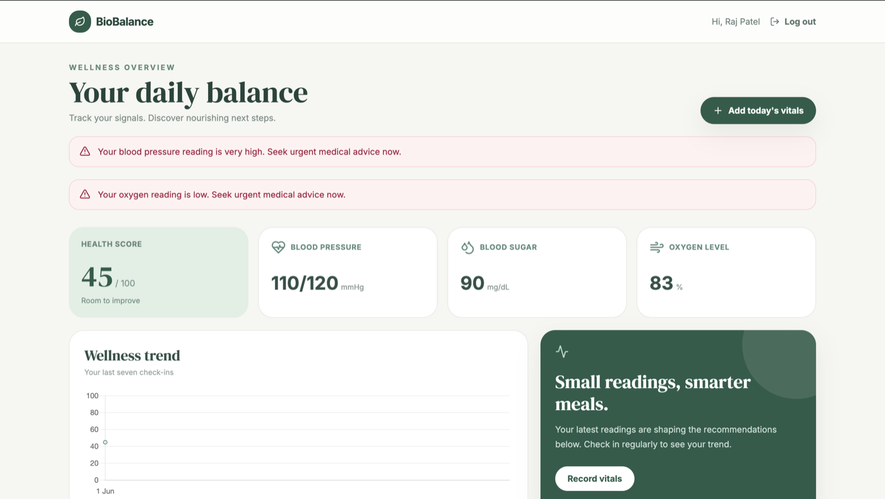
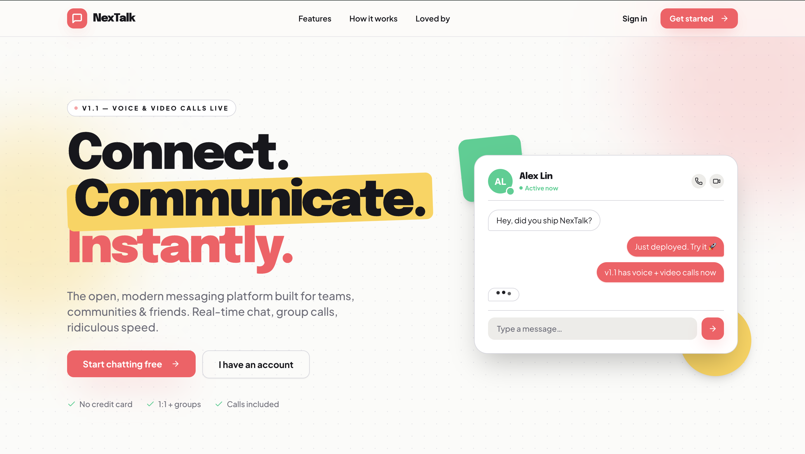

  

### 🚀 Full Stack Developer • AI/ML Enthusiast • Competitive Programmer

---

# 💫 About Me

🎓 CSE Student passionate about building impactful technology through
AI, Full Stack Development, and Problem Solving.

💡 I love developing scalable applications, solving DSA problems,
and building innovative hackathon projects.

### 🚀 Current Focus

* 🌱 Learning **Advanced Full Stack Development & AI Systems**
* ⚡ Solving **LeetCode & Competitive Programming Problems**
* 🧠 Exploring **AI/ML + Scalable Backend Architecture**
* 🛠 Building impactful real-world projects

---

# 🏆 Achievements

* 💻 Solved **200+ LeetCode Problems**
* 🎖 Certified **Oracle Foundation Associate**
* 🏅 Participant — **HACKIIT KANPUR 2026**
* 🚀 Built multiple Full Stack & AI-powered projects

---

# ⚒️ Tech Stack

## 👨‍💻 Languages

---

## 🌐 Full Stack Development

---

## 🛠 Tools & Technologies

---

# 🚀 Featured Projects

## 🚨 ResQ-Her

Women safety and emergency assistance platform focused on accessibility, quick response, and safety solutions.

<table>
<tr>
<td valign="top" width="60%">

### 🔹 Features

* Emergency SOS System
* Accessibility-Focused UI
* Fast Response Assistance
* Real-Time Safety Support
* User-Friendly Design

</td>

<td valign="top" width="40%">

### 🛠 Tech Stack

* React.js
* Node.js
* MongoDB
* Express.js
* Tailwind CSS
* JavaScript

</td>
<tr>
  <td colspan="2" align="center">

  

  </td>
</tr>
</tr>
</table>

🔗 **GitHub:**
https://github.com/Rajpatel2924/ResQ-Her

---

## 👑 RajGharana

Luxury fashion eCommerce platform built using Next.js, Clerk, and Razorpay.

<table>
<tr>
<td valign="top" width="60%">

### 🔹 Features

* Modern Premium UI
* Secure Authentication
* Online Payments
* Product Management
* Responsive Shopping Experience

</td>

<td valign="top" width="40%">

### 🛠 Tech Stack

* Next.js
* Clerk Authentication
* Razorpay
* MongoDB
* Tailwind CSS
* Vercel

</td>
<tr>
  <td colspan="2" align="center">

  

  </td>
</tr>
</tr>
</table>

🔗 **GitHub:**
https://github.com/Rajpatel2924/RajGharana

🌐 **Live Website:**
https://raj-gharana.vercel.app/

---

## 🛡️ PolicyGuard

Offline Policy Gap Analysis & Improvement Module powered using Local LLMs.

<table>
<tr>
<td valign="top" width="60%">

### 🔹 Features

* AI-Based Policy Analysis
* Offline LLM Integration
* Policy Gap Detection
* Recommendation Engine
* Secure Offline Processing

</td>

<td valign="top" width="40%">

### 🛠 Tech Stack

* Python
* Local LLMs
* Machine Learning
* NLP
* Streamlit
* SQLite

</td>
<tr>
  <td colspan="2" align="center">

  

  </td>
</tr>
</tr>
</table>

🔗 **GitHub:**
https://github.com/Rajpatel2924/PolicyGuard

---

## 🩺 BioBalance

AI-inspired wellness tracking and personalized meal guidance system.

<table>
<tr>
<td valign="top" width="60%">

### 🔹 Features

* Authentication System
* Wellness Dashboard
* Smart Meal Recommendations
* Family Care Sharing
* Health Tracking

</td>

<td valign="top" width="40%">

### 🛠 Tech Stack

* React.js
* Node.js
* MongoDB
* Express.js
* JWT Authentication
* Tailwind CSS

</td>
<tr>
  <td colspan="2" align="center">

  

  </td>
</tr>
</tr>
</table>

🔗 **GitHub:**
https://github.com/Rajpatel2924/Biobalance

---

## 💬 NexTalk

A scalable full-stack real-time communication platform built with WebSockets and WebRTC, enabling seamless messaging, voice calls, and video calls in a modern and responsive interface.

<table>
<tr>
<td valign="top" width="60%">

### 🔹 Features

* Real-Time One-to-One Messaging
* Online Presence & Typing Indicators
* Read Receipts & Message Synchronization
* Secure JWT Authentication
* Voice Calling using WebRTC
* Video Calling using WebRTC
* Responsive Dark & Light Mode UI
* Production Deployment on Vercel & Render

</td>

<td valign="top" width="40%">

### 🛠 Tech Stack

* React.js
* FastAPI
* PostgreSQL
* WebSocket
* WebRTC
* JWT Authentication
* Tailwind CSS
* Vercel & Render

</td>
<tr>
  <td colspan="2" align="center">

  

  </td>
</tr>
</tr>
</table>

🔗 **GitHub:**
https://github.com/Rajpatel2924/NexTalk

🌐 **Live Website:**
https://nex-talk-2k26.vercel.app/

---

# 🏅 Competitive Programming

* 🔹 Solved **200+ DSA Problems**
* 🔹 Active on LeetCode & CP Platforms
* 🔹 Focused on mastering Algorithms & Interview Preparation
* 🔹 Passionate about problem-solving and optimization

---

# 🌐 Connect With Me

---

# ✨ Quote

### ⭐ “Obsessed with building, learning, and pushing beyond limits.””

